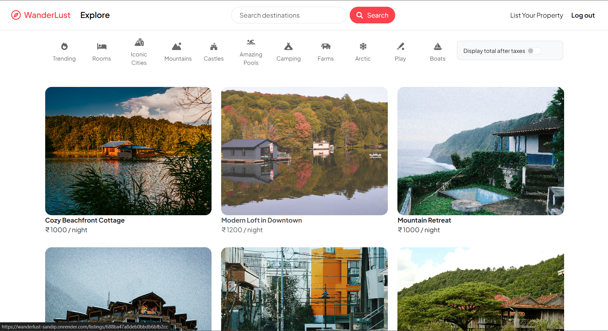

# WonderLust 🏡


---

## 🚀 Live Demo

👉 [Click here to view](https://wanderlust-sandip.onrender.com)

---

## 📌 Description

**WonderLust** is a full-stack web application inspired by Airbnb.  
It allows users to explore listings, book stays, and manage their properties.  
Built with **Node.js, Express.js, MongoDB, EJS, and Passport.js** for authentication.

---

## ⚙️ Features

- User authentication (Sign Up, Login, Logout)
- Add, edit, and delete property listings
- Image upload (Cloudinary)
- Flash messages & form validation
- Responsive UI
- Category-based filtering

---

## 🛠 Tech Stack

- **Frontend:** HTML, CSS, JavaScript, EJS
- **Backend:** Node.js, Express.js
- **Database:** MongoDB, Mongoose
- **Authentication:** Passport.js
- **Image Hosting:** Cloudinary

---

## 📷 Screenshots

### Home Page



### Listings Page


### Property Detail Page


_(Add your screenshots in a `screenshots` folder in the repository and update paths above)_

---

## ⚡ Installation

```bash
# Clone repository
git clone https://github.com/sandip-pal1/wanderlust-travel.git

# Go to project folder
cd wanderlust-travel

# Install dependencies
npm install

# Add your environment variables (.env)
# Example:
# ATLASDB_URL=your_mongodb_uri
# CLOUDINARY_CLOUD_NAME=xxx
# CLOUDINARY_API_KEY=xxx
# CLOUDINARY_API_SECRET=xxx

# Run server
node app.js
```

---

## 🔗 Links

- **Live Demo:** [https://wanderlust-sandip.onrender.com](https://wanderlust-sandip.onrender.com)
- **GitHub Repo:** [https://github.com/sandip-pal1/wanderlust-travel](https://github.com/sandip-pal1/wanderlust-travel)

---

## ✨ Author

**Sandip Pal**  
[GitHub](https://github.com/sandip-pal1) | [LinkedIn](https://www.linkedin.com/in/sandip-pal-7877b9285/)
